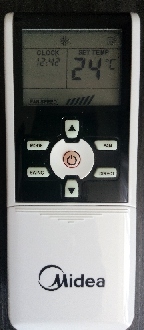
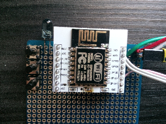
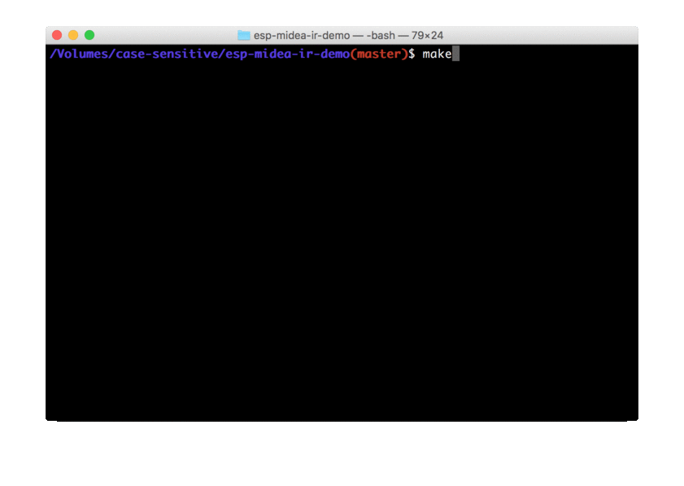

# esp-midea-ir-demo

Demo application for Midea Air conditioner IR remote control using ESP8266.
Demonstrates usage of [esp-midea-ir](https://github.com/sheinz/esp-midea-ir) library.

The library is developed to mimick a remote that looks like:

The demo hardware:

To get a good reception of IR signal you need quite high current to drive IR LED.
So, additional transistor is required to pump around 100mA through IR LED.

The software is based on [esp-open-rtos](https://github.com/SuperHouse/esp-open-rtos).
The included demo uses GPIO 14.
Use serial connection with speed 115200 to input commands.

